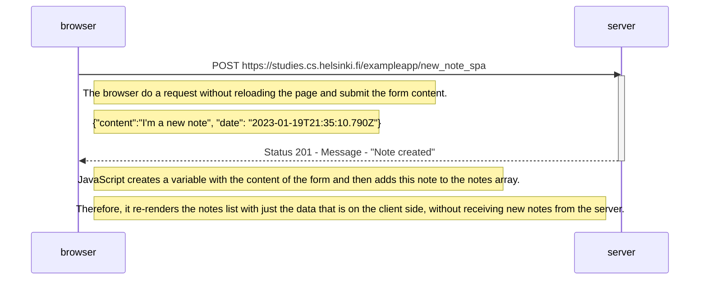

```mermaid
sequenceDiagram
    participant browser
    participant server

    browser->>server: POST https://studies.cs.helsinki.fi/exampleapp/new_note_spa
    activate server
    note right of browser: The browser do a request without reloading the page and submit the form content.
    note right of browser: {"content":"I'm a new note", "date": "2023-01-19T21:35:10.790Z"}
    server-->>browser: Status 201 - Message - "Note created"
    deactivate server

    note right of browser: JavaScript creates a variable with the content of the form and then adds this note to the notes array.
    note right of browser: Therefore, it re-renders the notes list with just the data that is on the client side, without receiving new notes from the server.
```
