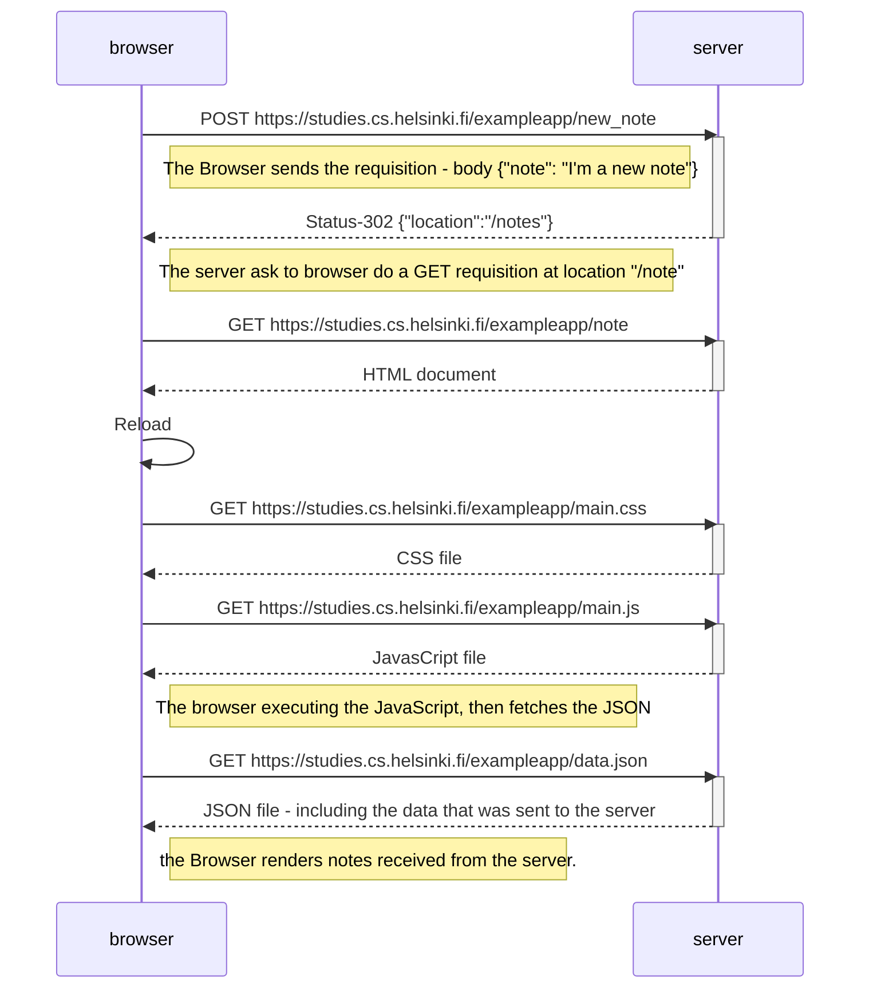

```mermaid
sequenceDiagram
    participant browser
    participant server
    
    browser->>server: POST https://studies.cs.helsinki.fi/exampleapp/new_note
    activate server
    note right of browser: The Browser sends the requisition - body {"note": "I'm a new note"}
    server-->>browser: Status-302 {"location":"/notes"}
    deactivate server
    
    note right of browser: The server ask to browser do a GET requisition at location "/note"
    
    browser->>server: GET https://studies.cs.helsinki.fi/exampleapp/note
    activate server
    server-->>browser: HTML document
    deactivate server

    browser->>browser: Reload

    browser->>server: GET https://studies.cs.helsinki.fi/exampleapp/main.css
    activate server
    server-->>browser: CSS file
    deactivate server

    browser->>server: GET https://studies.cs.helsinki.fi/exampleapp/main.js
    activate server
    server-->>browser: JavasCript file
    deactivate server

    Note right of browser: The browser executing the JavaScript, then fetches the JSON

    browser->>server: GET https://studies.cs.helsinki.fi/exampleapp/data.json
    activate server
    server-->>browser: JSON file - including the data that was sent to the server
    deactivate server

    Note right of browser: the Browser renders notes received from the server.
```
